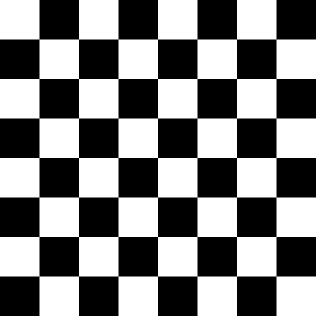
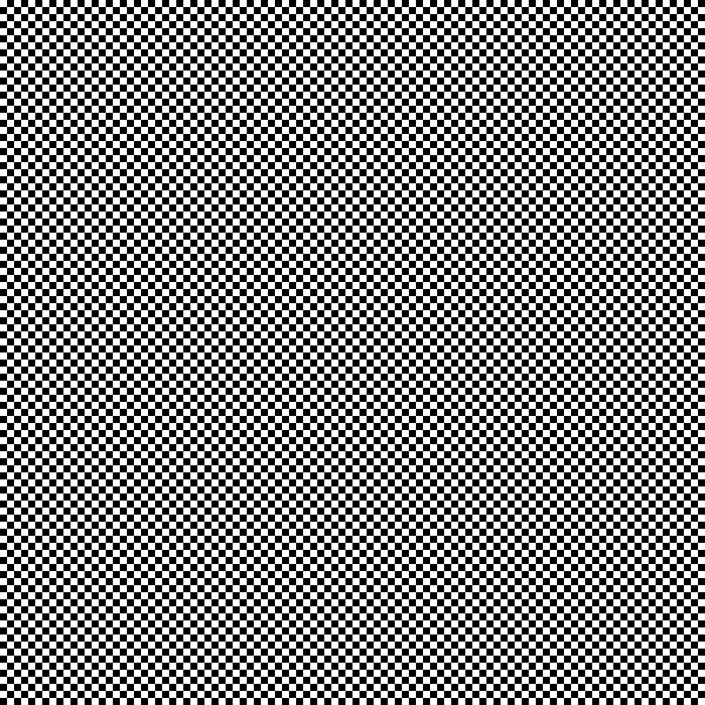
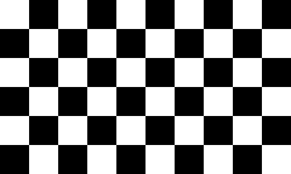
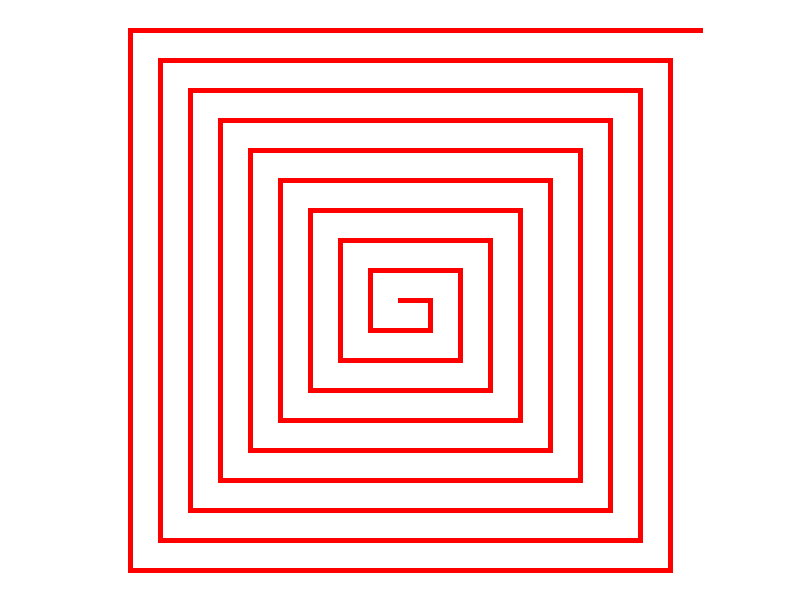
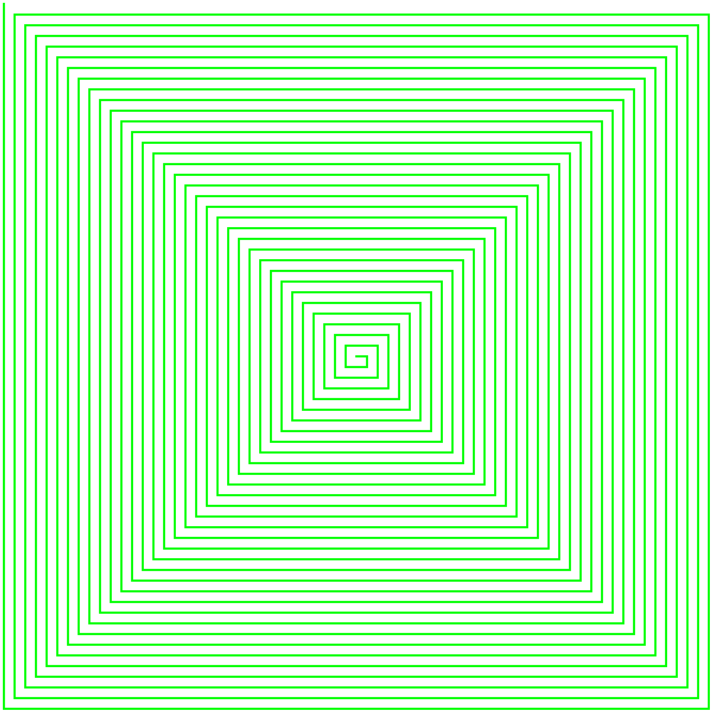
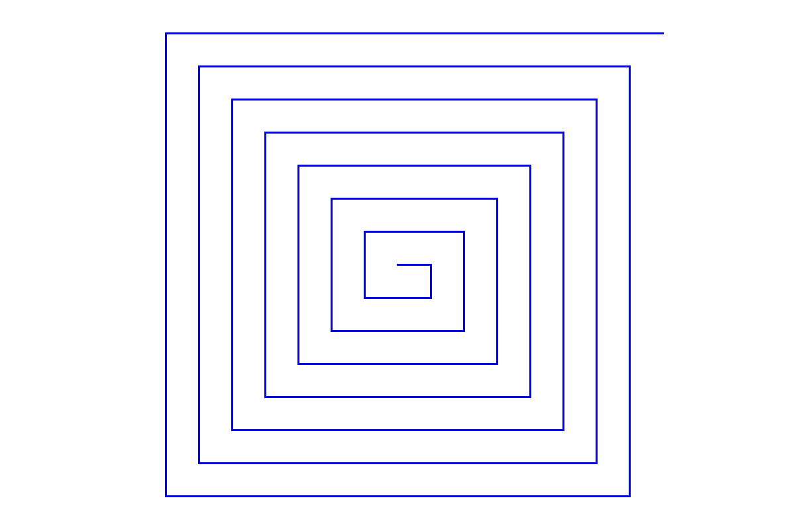

# Лабораторная работа 1: Работа с изображениями в OpenCV

## Задание 1: Генерация шахматной доски

Программа создает изображение шахматной доски с настраиваемыми параметрами размера и сохраняет его в форматах PPM и PNG.

### Параметры командной строки

- `--rows` - количество строк на шахматной доске (по умолчанию: 8)
- `--cols` - количество столбцов на шахматной доске (по умолчанию: 8)
- `--cell` - размер одной клетки в пикселях (по умолчанию: 50)
- `--output` - имя выходного файла без расширения (по умолчанию: chessboard)

### Примеры использования

#### Пример 1: Стандартная шахматная доска 8x8

```bash
./lab1 --rows 8 --cols 8 --cell 50
```

Этот пример создаст классическую шахматную доску размером 8x8 клеток, где каждая клетка имеет размер 50x50 пикселей.



#### Пример 2: Большая доска с маленькими клетками

```bash
./lab1 --rows 12 --cols 12 --cell 30 --output chess_large
```

В этом примере создается большая шахматная доска 12x12 с клетками меньшего размера.



#### Пример 3: Прямоугольная доска

```bash
./lab1 --rows 6 --cols 10 --cell 60 --output chess_rect
```

Этот пример демонстрирует создание прямоугольной шахматной доски.



### Структура проекта для Задания 1

```
opencv_1/
├── task1/
│   ├── lab1                   # Исполняемый файл программы
│   ├── chessboard             # Исполняемый файл дополнительной программы
│   ├── chessboard.cpp         # Исходный код шахматной доски
│   ├── CMakeLists.txt         # Конфигурация сборки
│   ├── build.sh               # Скрипт для сборки
│   ├── generate_chessboard.sh # Скрипт для генерации шахматной доски
│   ├── convert_to_png.sh      # Скрипт для конвертации в PNG
│   ├── images/                # Директория для сохранения изображений
│   ├── images_chess/          # Дополнительная директория с изображениями
│   └── build/                 # Директория для файлов сборки
```

### Сборка и запуск

1. Перейдите в директорию задания:
```bash
cd task1
```

2. Используйте один из следующих способов запуска:

#### Способ 1: Прямой запуск исполняемого файла lab1

Программа уже скомпилирована и готова к запуску:
```bash
./lab1 --rows 8 --cols 8 --cell 50
```

#### Способ 2: Использование скрипта generate_chessboard.sh

Вы можете использовать скрипт для автоматизации процесса:
```bash
chmod +x generate_chessboard.sh
./generate_chessboard.sh --rows 8 --cols 8 --cell 50 --output chess_classic
```

Этот скрипт запускает программу с указанными параметрами и выполняет дополнительную обработку результатов, например, конвертацию в PNG формат.

### Особенности реализации

- Программа создает изображение в формате PPM (Portable Pixmap Format)
- Автоматически конвертирует PPM в PNG с помощью скрипта convert_to_png.sh
- Использует эффективный алгоритм генерации с вложенными циклами
- Корректно обрабатывает чередование черных и белых клеток
- Все изображения сохраняются в директориях `images` и `images_chess`

## Задание 2: Генерация квадратной спирали

Программа создает изображение с нарисованной квадратной спиралью в виде улитки, которая начинается из центра и раскручивается к краям изображения по прямоугольной траектории с чёткими углами 90 градусов. Рисование происходит строго по пикселям без использования встроенных функций рисования фигур. Пользователь может настраивать различные параметры спирали через аргументы командной строки.

### Параметры командной строки

- `--width` - ширина изображения в пикселях
- `--height` - высота изображения в пикселях
- `--thick` - толщина линии спирали в пикселях
- `--step` - расстояние между витками спирали в пикселях
- `--color` - цвет спирали в формате R,G,B (например, "255,0,0" для красного цвета)

### Примеры использования

#### Пример 1: Красная спираль с большой толщиной и средним шагом

```bash
./build/square_spiral --width 800 --height 600 --thick 5 --step 30 --color 255,0,0
```

Этот пример создаст изображение размером 800x600 пикселей с красной спиралью. Толщина линии 5 пикселей и расстояние между витками 30 пикселей создают четкую, хорошо видимую спираль.



#### Пример 2: Тонкая зеленая спираль с частыми витками

```bash
./build/square_spiral --width 1000 --height 1000 --thick 2 --step 15 --color 0,255,0
```

В этом примере создается квадратное изображение 1000x1000 пикселей с тонкой зеленой спиралью. Малая толщина линии (2 пикселя) и небольшой шаг между витками (15 пикселей) создают более детализированную спираль с частыми витками.



#### Пример 3: Синяя спираль с большим расстоянием между витками

```bash
./build/square_spiral --width 1200 --height 800 --thick 3 --step 50 --color 0,0,255
```

Этот пример демонстрирует создание синей спирали на прямоугольном изображении 1200x800 пикселей. Средняя толщина линии (3 пикселя) и большой шаг между витками (50 пикселей) создают спираль с широкими, хорошо различимыми витками.



### Особенности реализации

- Спираль рисуется строго по пикселям без использования встроенных функций рисования OpenCV
- Используется алгоритм Брезенхема для рисования линий
- Каждый сегмент спирали представляет собой прямую линию с 90-градусным поворотом
- Длина сегментов увеличивается на указанный шаг каждые два поворота
- Рисование начинается из центра изображения и продолжается до тех пор, пока спираль не достигнет края

### Структура проекта для Задания 2

```
opencv_1/
├── task2/
│   ├── spiral_generator.cpp  # Реализация генератора квадратной спирали-улитки
│   ├── CMakeLists.txt        # Конфигурация сборки
│   ├── build.sh              # Скрипт для сборки
│   ├── build/                # Директория для файлов сборки и исполняемых файлов
│   │   └── square_spiral    # Исполняемый файл программы для квадратной спирали
│   └── images_spiral/        # Директория для сохранения изображений
│       ├── square_spiral_800x600_5_30.png    # Красная спираль
│       ├── square_spiral_1000x1000_2_15.png  # Зеленая спираль
│       └── square_spiral_1200x800_3_50.png   # Синяя спираль
```

### Сборка и запуск

1. Перейдите в директорию задания:
```bash
cd task2
```

2. Если требуется пересобрать проект:
```bash
chmod +x build.sh
./build.sh
```

3. Запустите программу с желаемыми параметрами:
```bash
./build/square_spiral --width 800 --height 600 --thick 5 --step 30 --color 255,0,0
```

### Примечания

- Если цвет не указан, по умолчанию используется красный (255,0,0)
- Изображения сохраняются в формате PNG в директории `images_spiral`
- Имя файла формируется автоматически и содержит все параметры спирали
- При некорректных параметрах программа выведет сообщение об ошибке и инструкцию по использованию 