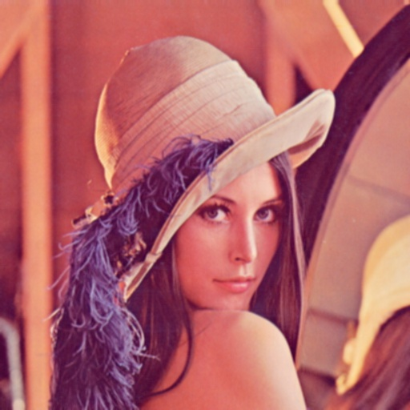
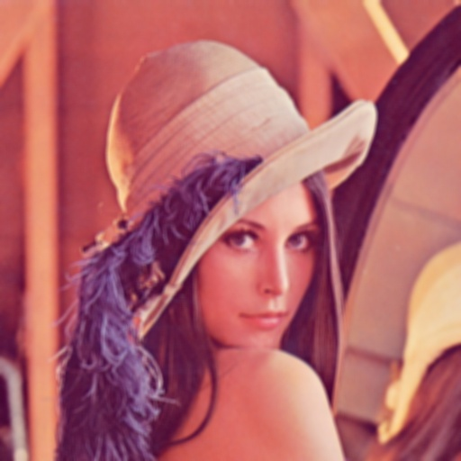

# Задание 1: Ручная реализация фильтра размытия

В этом задании реализован фильтр размытия (усредняющий) вручную, без использования встроенных функций OpenCV, таких как `blur` или `filter2D`. Программа применяет свёртку с нормированным ядром, заполненным единицами, для достижения эффекта размытия изображения.

## Принцип работы

Фильтр размытия работает по принципу свёртки изображения с ядром. Для каждого пикселя в изображении:
1. Рассматривается окрестность размера `kernel × kernel`
2. Все значения в этой окрестности усредняются
3. Результат становится новым значением пикселя

Математически это выражается формулой:

```
I_new(x,y) = (1 / (kernel * kernel)) * Σ I(x+i, y+j)
```

где суммирование идёт по всем индексам i, j из окрестности текущего пикселя.

## Параметры командной строки

- `--input` - путь к входному изображению
- `--output` - путь к выходному изображению
- `--kernel` - размер ядра (только нечётное число, например, 3, 5, 7)

## Примеры использования

### Пример 1: Слабое размытие (ядро 3×3)

```bash
./lab2 --input image.jpg --output blur_kernel3.jpg --kernel 3
```

Размытие с ядром 3×3 даёт слабый эффект размытия, сохраняя многие детали исходного изображения.



### Пример 2: Среднее размытие (ядро 5×5)

```bash
./lab2 --input image.jpg --output blur_kernel5.jpg --kernel 5
```

Размытие с ядром 5×5 даёт умеренный эффект размытия, сглаживая мелкие детали, но сохраняя основную структуру изображения.



### Пример 3: Сильное размытие (ядро 9×9)

```bash
./lab2 --input image.jpg --output blur_kernel9.jpg --kernel 9
```

Размытие с ядром 9×9 даёт сильный эффект размытия, значительно сглаживая детали изображения.


## Особенности реализации

- Изображение хранится в массиве `cv::Mat`, но обработка происходит с ручным доступом по индексам
- Обработка границ осуществляется с зеркальным отражением за границами изображения
- Реализация учитывает различные типы входных изображений (цветные и монохромные)
- Алгоритм оптимизирован для минимизации повторных вычислений

## Сборка и запуск

### Шаг 1: Создание CMakeLists.txt

```bash
cat > CMakeLists.txt << EOF
cmake_minimum_required(VERSION 3.10)
project(manual_blur)

set(CMAKE_CXX_STANDARD 11)
set(CMAKE_CXX_STANDARD_REQUIRED ON)

find_package(OpenCV REQUIRED)

add_executable(lab2 lab2.cpp)
target_link_libraries(lab2 \${OpenCV_LIBS})
EOF
```

### Шаг 2: Компиляция проекта

```bash
mkdir -p build
cd build
cmake ..
make
```

### Шаг 3: Запуск программы

```bash
./lab2 --input ../image.jpg --output ../blur_kernel5.jpg --kernel 5
```

## Исходный код

Исходный код программы находится в файле [lab2.cpp](lab2.cpp).

## Результаты

Результаты работы программы показывают, что ручная реализация фильтра размытия эффективно справляется с задачей и даёт визуальные результаты, сравнимые с встроенными функциями OpenCV. Чем больше размер ядра, тем сильнее эффект размытия, но тем больше времени требуется на обработку изображения.

### Влияние размера ядра на качество размытия

| Размер ядра | Эффект | Время обработки |
|-------------|--------|-----------------|
| 3×3         | Слабое размытие | Быстро |
| 5×5         | Среднее размытие | Умеренно |
| 9×9         | Сильное размытие | Медленно |

## Дополнительная информация

При реализации алгоритма особое внимание было уделено корректной обработке границ изображения. Для этого использован метод зеркального отражения, который позволяет избежать артефактов на краях изображения. 