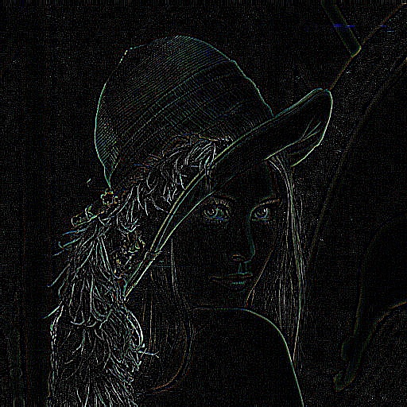

# Задание 2: Реализация пользовательского ядра свёртки

В этом задании реализовано применение произвольного ядра свёртки к изображению, где ядро загружается из текстового файла. Программа выполняет свёртку изображения вручную, без использования встроенных функций OpenCV.

## Принцип работы

Свёртка изображения с произвольным ядром выполняется следующим образом:
1. Программа считывает матрицу ядра из текстового файла
2. Для каждого пикселя изображения:
   - Рассматривается окрестность размера ядра
   - Каждый пиксель окрестности умножается на соответствующий элемент ядра
   - Результаты умножения суммируются
   - Итоговое значение становится новым значением пикселя

## Параметры командной строки

- `--input` - путь к входному изображению
- `--output` - путь к выходному изображению
- `--kernel_file` - путь к текстовому файлу, содержащему матрицу ядра

## Формат файла ядра

Файл с ядром должен иметь следующий формат:
```
3
0 -1 0
-1 5 -1
0 -1 0
```

Где первая строка указывает размер ядра (в данном случае 3×3), а последующие строки содержат значения элементов ядра.

## Примеры использования

### Пример 1: Повышение резкости изображения

```bash
./build/lab2 --input images/test_image.jpg --output images/sharpen.jpg --kernel_file kernel_sharpen.txt
```

Содержимое файла `kernel_sharpen.txt`:
```
3
0 -1 0
-1 5 -1
0 -1 0
```

Это ядро усиливает центральный пиксель и вычитает соседние, что приводит к увеличению контраста и более отчётливым границам.


### Пример 2: Выделение границ

```bash
./build/lab2 --input images/test_image.jpg --output images/edge_detection.jpg --kernel_file kernel_edge_detection.txt
```

Содержимое файла `kernel_edge_detection.txt`:
```
3
-1 -1 -1
-1 8 -1
-1 -1 -1
```

Это ядро выделяет границы на изображении, подчёркивая резкие переходы между областями разной интенсивности.



### Пример 3: Эффект рельефа (emboss)

```bash
./build/lab2 --input images/test_image.jpg --output images/emboss.jpg --kernel_file kernel_emboss.txt
```

Содержимое файла `kernel_emboss.txt`:
```
3
-2 -1 0
-1 1 1
0 1 2
```

Это ядро создаёт эффект рельефа, делая изображение похожим на выдавленное на металлической пластине.


## Особенности реализации

- Свёртка реализована вручную, без использования встроенных функций OpenCV
- Обработка границ изображения выполняется с использованием техники зеркального отражения
- Программа корректно обрабатывает цветные и монохромные изображения
- Сохраняет результат с соответствующим форматом и цветовой схемой
- После применения ядра значения пикселей ограничиваются в диапазоне [0, 255]

## Сборка и запуск

### Шаг 1: Клонирование репозитория

```bash
git clone <url_репозитория>
cd <репозиторий>/opencv_2/task2
```

### Шаг 2: Сборка проекта

```bash
chmod +x build.sh
./build.sh
```

### Шаг 3: Создание файла с ядром

Создайте текстовый файл (например, `my_kernel.txt`) со следующим форматом:
```
3
1 0 -1
2 0 -2
1 0 -1
```

### Шаг 4: Запуск программы

```bash
./build/lab2 --input <путь_к_изображению> --output <выходной_файл> --kernel_file <файл_ядра>
```

## Пример использования разных ядер

| Ядро | Описание | Эффект |
|------|----------|--------|
| 3×3 с центральным пикселем 5 | Повышает резкость изображения | Увеличивает контраст, делает границы более отчётливыми |
| 3×3 с центральным пикселем 8 и -1 по периметру | Выделяет границы | Подчёркивает переходы между разными областями, остальные участки становятся тёмными |
| 3×3 с диагональным градиентом | Создаёт эффект рельефа | Делает изображение выпуклым, имитирует объём |

## Расширение функциональности

Программу можно расширить, добавив поддержку:
- Ядер произвольного размера (5×5, 7×7 и т.д.)
- Нормализации ядра (автоматическое деление на сумму элементов)
- Параллельной обработки для ускорения работы на многоядерных процессорах 